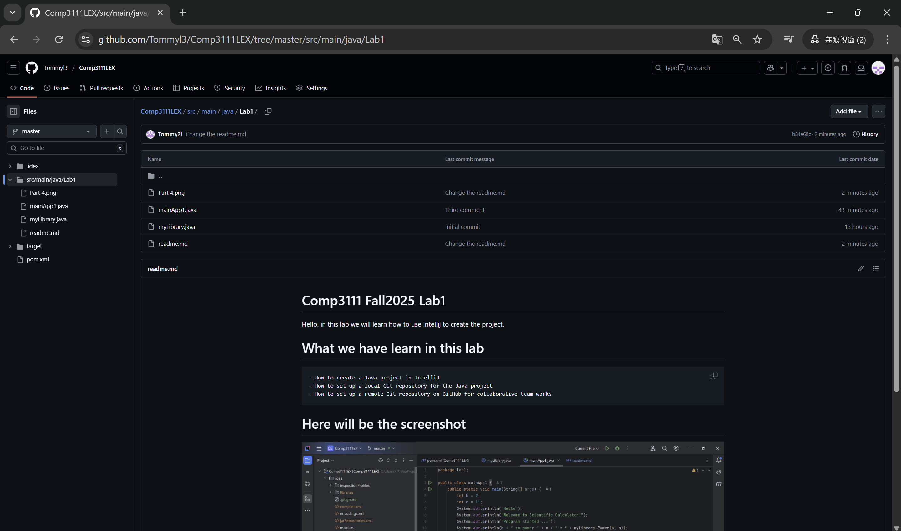

# Comp3111 Fall2025 Lab1
Hello, in this lab we will learn how to use Intellij to create the project.

# What we have learn in this lab
    - How to create a Java project in IntelliJ
    - How to set up a local Git repository for the Java project
    - How to set up a remote Git repository on GitHub for collaborative team works

# Here will be the screenshot

- Part 4

- Part 5
